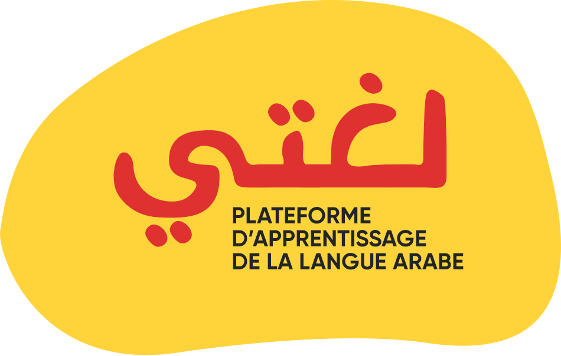

<p align="center">
    <a href="loughati arabic learning plateforme" target="_blank">
        
    </a>
</p>

# loughati

> A Vue.js project
لغتي est une plateforme d'apprentissage en ligne de la langue arabe, destinée principalement au petits enfants de la tranche d'âge entre 6 et 14 ans. Elle couvre les programmes scolaires du primaire jusqu'au CEM.
Ce projet fait partie du projet de fin d’études (PFE) intitulé: Un outil d’aide à la construction de dictionnaires par niveaux d’apprenants pour la langue arabe.

## Build Setup

``` bash
# install dependencies
npm install

# serve with hot reload at localhost:8080
npm run dev

# build for production with minification
npm run build

# build for production and view the bundle analyzer report
npm run build --report

# run unit tests
npm run unit

# run e2e tests
npm run e2e

# run all tests
npm test
```

For a detailed explanation on how things work, check out the [guide](http://vuejs-templates.github.io/webpack/) and [docs for vue-loader](http://vuejs.github.io/vue-loader).
